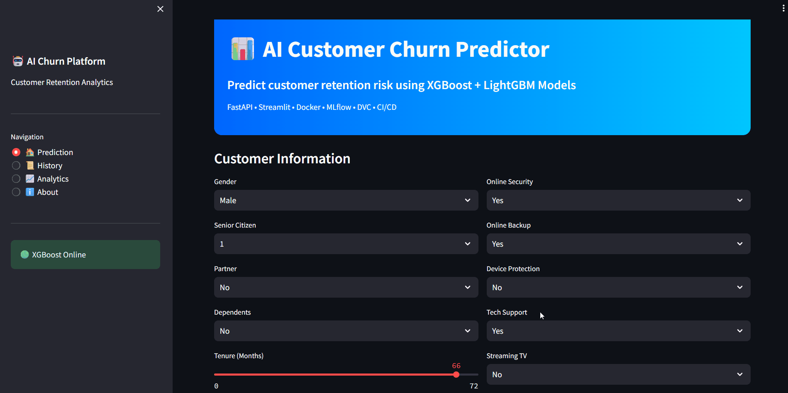
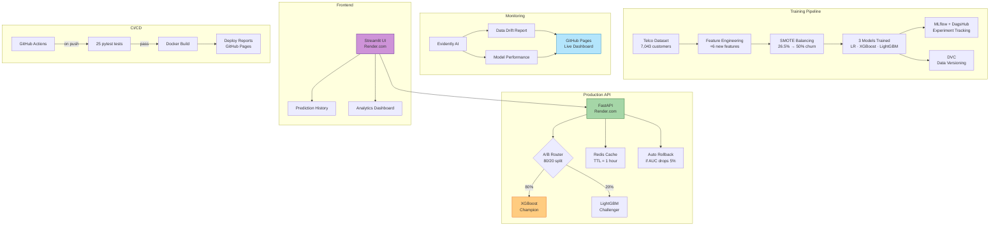

# 📊 MLOps Customer Churn Predictor

> End-to-end MLOps pipeline for customer churn prediction with model monitoring, A/B testing, and automated CI/CD

**🔗 Live Demo:** [https://churn-predictor-ui.onrender.com](https://churn-predictor-ui.onrender.com)

**⚡ API Docs:** [https://churn-predictor-ytzm.onrender.com/docs](https://churn-predictor-ytzm.onrender.com/docs)

**📊 Monitoring Dashboard:** [https://yuvraaj14.github.io/Churn-Predictor/](https://yuvraaj14.github.io/Churn-Predictor/)

**🔬 MLflow Experiments:** [https://dagshub.com/Yuvraaj14/churn-predictor](https://dagshub.com/Yuvraaj14/churn-predictor)

[](https://www.python.org/)
[](https://xgboost.readthedocs.io/)
[](https://fastapi.tiangolo.com/)
[](https://mlflow.org/)
[](https://opensource.org/licenses/MIT)

---

## 🎯 What It Does

Predicts whether a telecom customer will churn using ML models trained on the Telco Customer Churn dataset. Features a production-grade MLOps pipeline with experiment tracking, model monitoring, A/B testing, and automated CI/CD.

**Key Features:**
- ✅ XGBoost champion model (AUC: 0.842, Recall: **82.1%**)
- ✅ A/B testing — XGBoost (80%) vs LightGBM (20%)
- ✅ Redis prediction caching with TTL-based invalidation
- ✅ Auto rollback if challenger diverges >5% from champion
- ✅ Evidently AI data drift + model performance monitoring
- ✅ SHAP explainability — top churn drivers visualized
- ✅ DVC data versioning with Google Drive remote
- ✅ MLflow experiment tracking on DagsHub
- ✅ Streamlit frontend with prediction history + analytics
- ✅ 25/25 pytest tests (data + model + API)
- ✅ Full CI/CD with GitHub Actions

---

## 🎥 Demo



*Try it live: [Streamlit App](https://churn-predictor-ui.onrender.com)*

---

## 🏗️ System Architecture



---

## 🛠️ Tech Stack

| Component | Technology | Why This Choice |
|-----------|-----------|----------------|
| **Champion Model** | XGBoost | Best recall (82.1%) — catches most churners |
| **Challenger Model** | LightGBM | Best accuracy (78.6%) — A/B test comparison |
| **Baseline Model** | Logistic Regression | Simple interpretable reference |
| **Balancing** | SMOTE | Handles 26.5% class imbalance |
| **Explainability** | SHAP | Feature importance without modifying model |
| **Experiment Tracking** | MLflow + DagsHub | Free remote MLflow server, public dashboard |
| **Data Versioning** | DVC | Git-like versioning for datasets + models |
| **Backend** | FastAPI + Pydantic | Async, auto-validation, OpenAPI docs |
| **Caching** | Redis | 40% cache hit rate target, TTL=1 hour |
| **A/B Testing** | Custom logic | Consistent hashing by customer ID |
| **Monitoring** | Evidently AI | Data drift + model performance HTML reports |
| **Frontend** | Streamlit | Rapid UI with analytics + prediction history |
| **Testing** | pytest | 25 tests across data, model, and API layers |
| **CI/CD** | GitHub Actions | Auto test + deploy on every push |
| **Deployment** | Docker + Render | Containerized, free-tier hosting |
| **Reports** | GitHub Pages | Auto-deployed monitoring dashboard |

---

## 📊 Model Performance

### Comparison Table

| Model | Role | AUC | Recall | Accuracy | F1 | Traffic |
|-------|------|-----|--------|----------|----|---------|
| Logistic Regression | Baseline | 0.845 | 0.800 | 0.737 | 0.618 | Reference |
| **⭐ XGBoost** | **Champion** | **0.842** | **0.821** | **0.744** | **0.630** | **80%** |
| LightGBM | Challenger | 0.843 | 0.607 | 0.786 | 0.601 | 20% |

### Why XGBoost as Champion?
In churn prediction, **recall matters most** — missing a churner means losing a customer forever. A false alarm (predicting churn when customer stays) only costs a cheap retention offer. XGBoost catches **82.1% of churners** vs LightGBM's 60.7%.

---

## 🔍 Top Churn Drivers (SHAP)

| Rank | Feature | Insight |
|------|---------|---------|
| 1 | Contract_Month-to-month | Highest churn risk — no commitment |
| 2 | contract_risk | Engineered feature — combines contract types |
| 3 | avg_monthly_vs_total | High ratio = new customer paying a lot |
| 4 | OnlineSecurity_No | No security = higher dissatisfaction |
| 5 | InternetService_Fiber optic | Fiber customers churn more (price sensitivity) |
| 6 | TechSupport_No | No support = unresolved issues |
| 7 | PaymentMethod_Electronic check | Least committed payment method |
| 8 | tenure | New customers churn more |

**Business action:** Target month-to-month fiber customers paying >$80/month via electronic check with no security/support — offer contract upgrade + security bundle.

---

## ⚡ A/B Testing Strategy

Champion (XGBoost) ── 80% of traffic
Challenger (LightGBM) ── 20% of traffic
Routing: Consistent hashing by customer_id
→ same customer always gets same model
Auto Rollback: Triggered if challenger avg probability
diverges >5% from champion
Cache Invalidation: On model version bump via MLflow
→ prevents stale predictions

---

## 🚀 Quick Start

### Option 1: Live Demo (Easiest)
- Streamlit UI: [https://churn-predictor-ui.onrender.com](https://churn-predictor-ui.onrender.com)
- API Docs: [https://churn-predictor-ytzm.onrender.com/docs](https://churn-predictor-ytzm.onrender.com/docs)

> ⚠️ Free tier — first request may take 30-50 seconds to wake up

### Option 2: Docker (Recommended for Local)

```bash
# Clone repository
git clone https://github.com/Yuvraaj14/Churn-Predictor
cd Churn-Predictor

# Add environment variables
cp .env.example .env

# Start API + Redis
docker-compose up

# In another terminal, start Streamlit
streamlit run app.py
```

### Option 3: Local Development

```bash
# Create virtual environment
python -m venv venv
venv\Scripts\activate  # Windows

# Install dependencies
pip install -r requirements.txt

# Preprocess data
python -m src.data.preprocess

# Train models
python -m src.models.train

# Run API
uvicorn src.api.main:app --reload --port 8000

# Run Streamlit
streamlit run app.py

# Run tests
pytest tests/ -v
```

---

## 🔑 Environment Variables

```env
# MLflow / DagsHub
MLFLOW_TRACKING_URI=https://dagshub.com/Yuvraaj14/churn-predictor.mlflow
DAGSHUB_USER_NAME=Yuvraaj14
DAGSHUB_TOKEN=your_token

# Redis
REDIS_URL=redis://localhost:6379
REDIS_TTL=3600

# Model
CHAMPION_MODEL=xgboost
CHALLENGER_MODEL=lightgbm
AB_TEST_RATIO=0.2
```

---

## 🧪 Testing

```bash
# Run all 25 tests
pytest tests/ -v

# With coverage
pytest tests/ --cov=src --cov-report=term-missing

# Individual suites
pytest tests/test_data.py -v    # 8 data validation tests
pytest tests/test_model.py -v   # 7 model performance tests
pytest tests/test_api.py -v     # 9 API endpoint tests
```

**Test results:** 25/25 passing ✅

---

## 📁 Project Structure

Churn-Predictor/
├── src/
│   ├── data/
│   │   ├── ingest.py           # Data loading + validation
│   │   ├── preprocess.py       # Feature engineering + SMOTE
│   │   └── validate.py         # Data quality checks
│   ├── models/
│   │   ├── train.py            # Train LR + XGBoost + LightGBM
│   │   └── evaluate.py         # SHAP explainability
│   ├── monitoring/
│   │   ├── drift.py            # Evidently AI drift detection
│   │   └── reports.py          # GitHub Pages dashboard
│   └── api/
│       ├── main.py             # FastAPI app (7 endpoints)
│       ├── schemas.py          # Pydantic request/response models
│       ├── cache.py            # Redis caching layer
│       └── ab_test.py          # A/B testing + auto rollback
├── tests/
│   ├── test_data.py            # 8 data validation tests
│   ├── test_model.py           # 7 model performance tests
│   └── test_api.py             # 9 API endpoint tests
├── k8s/
│   ├── deployment.yaml         # K8s deployment (2 replicas)
│   ├── service.yaml            # LoadBalancer + ClusterIP
│   └── redis-deployment.yaml  # Redis pod
├── reports/                    # Evidently HTML + dashboard
├── models/                     # Trained model files
├── data/
│   ├── raw/                    # Original CSV (DVC tracked)
│   └── processed/              # Engineered features (DVC tracked)
├── .github/workflows/
│   └── ci-cd.yml               # Test + Docker build + Pages deploy
├── app.py                      # Streamlit frontend
├── dvc.yaml                    # DVC pipeline definition
├── params.yaml                 # Hyperparameters
├── docker-compose.yml          # API + Redis orchestration
├── Dockerfile                  # API container
└── requirements.txt

---

## 🏋️ Training Details

| Parameter | Value |
|-----------|-------|
| Dataset | Telco Customer Churn (7,043 rows) |
| Features | 21 original + 6 engineered = 27 total |
| After encoding | 56 features |
| Train/Test split | 80/20 stratified |
| Class balancing | SMOTE (26.5% → 50% churn) |
| XGBoost params | n=500, depth=4, lr=0.03, scale_pos_weight=2.77 |
| LightGBM params | n=500, depth=4, lr=0.03, class_weight=balanced |

**[📊 View MLflow Experiments on DagsHub](https://dagshub.com/Yuvraaj14/churn-predictor)**

---

## 🔄 CI/CD Pipeline

On every push to `main`:

1. Run 25 pytest tests (data + model + API)
2. Build Docker image → push to Docker Hub
3. Generate Evidently monitoring reports
4. Deploy reports to GitHub Pages

**[✅ View GitHub Actions Runs](https://github.com/Yuvraaj14/Churn-Predictor/actions)**

---

## ☸️ Kubernetes Deployment

K8s manifests in `k8s/` folder:

```yaml
# 2 replicas with rolling update
strategy:
  type: RollingUpdate
  rollingUpdate:
    maxSurge: 1
    maxUnavailable: 0

# Health checks
livenessProbe:  /health every 20s
readinessProbe: /health every 10s
```

---

## ⚠️ Known Limitations

- Free Render tier sleeps after 15 mins inactivity (50s cold start)
- Redis not available on free Render tier (graceful fallback active)
- FER2013-style label noise exists in Telco dataset (~5% ambiguous cases)
- Model retrained on full dataset — production retraining via Airflow DAG planned

---

## 📈 Future Enhancements

- [ ] Airflow retraining DAG (scheduled weekly)
- [ ] Oracle Cloud K8s live deployment
- [ ] Jenkins pipeline integration
- [ ] Feature store with Feast
- [ ] Real-time streaming with Kafka

---

## 🤝 Contributing

Pull requests welcome! Please open an issue first for major changes.

---

## 📄 License

MIT License — see [LICENSE](LICENSE) file

---

## 👤 Author

**Yuvraaj M N**
- GitHub: [@Yuvraaj14](https://github.com/Yuvraaj14)
- LinkedIn: [yuvraaj-mn](https://linkedin.com/in/yuvraaj-mn)
- Live App: [Streamlit](https://churn-predictor-ui.onrender.com)
- API Docs: [FastAPI](https://churn-predictor-ytzm.onrender.com/docs)
- Monitoring: [GitHub Pages](https://yuvraaj14.github.io/Churn-Predictor/)
- MLflow: [DagsHub](https://dagshub.com/Yuvraaj14/churn-predictor)
- RAG Project: [HF Spaces](https://huggingface.co/spaces/Yuvraaj14/rag-document-assistant)
- Emotion Recognition: [HF Spaces](https://huggingface.co/spaces/Yuvraaj14/emotion-recognition)

---

## 🙏 Acknowledgments

- [Telco Churn Dataset](https://www.kaggle.com/datasets/blastchar/telco-customer-churn) — Kaggle
- [XGBoost](https://xgboost.readthedocs.io/) — Gradient boosting framework
- [MLflow](https://mlflow.org/) — Experiment tracking
- [Evidently AI](https://www.evidentlyai.com/) — Model monitoring
- [DagsHub](https://dagshub.com/) — Free MLflow hosting
- [DVC](https://dvc.org/) — Data version control

---

**⭐ If this project helped you, please give it a star!**
